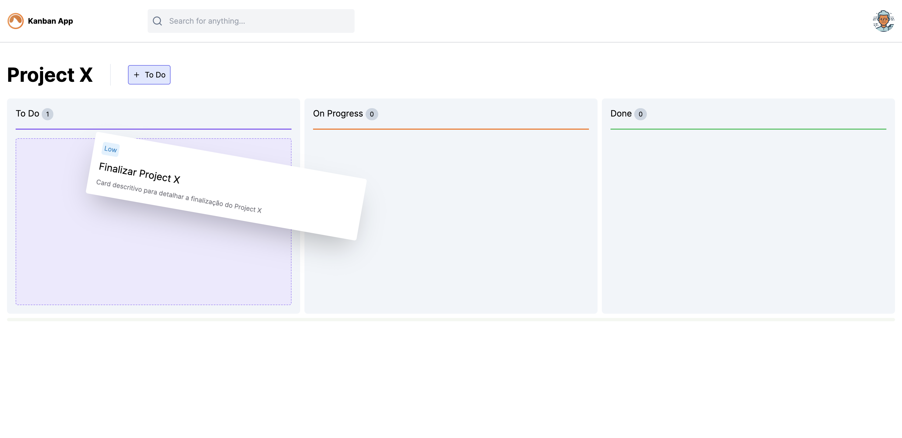

  

  

  

 
 

# Kanban App

Inspirado em um projeto encontrado no figma: [figma link](<https://www.figma.com/file/dxOcUDVbLggeOTXfRtAbkI/Project-Management-Dashboard-(Community)?type=design&node-id=2-163&mode=design&t=F8QAyGOJegxyDbTX-0>)

<!-- https://codesandbox.io/p/sandbox/react-drag-and-drop-react-beautiful-dnd-w5szl?file=%2Fsrc%2Findex.js%3A152%2C19-152%2C41 -->

## 📑 Sobre o Projeto

O projeto foi desenvolvido para praticar o uso de React com NextJS e TailwindCSS, também foi agregado os conhecimentos em TypeScript e como um plus no projeto foi utilizada a biblioteca [@hello-pangea/dnd](https://github.com/hello-pangea/dnd) para fazer o Drag and Drop.

## 🚀 Tecnologias Usadas

<!-- ## 📚 Future Features

...

- [ x ] ... -->

## 📝 License

This project is under the MIT license. See the [LICENSE](LICENSE) file for more details.

---

Made with by [Murilio](https://murilio.dev)
